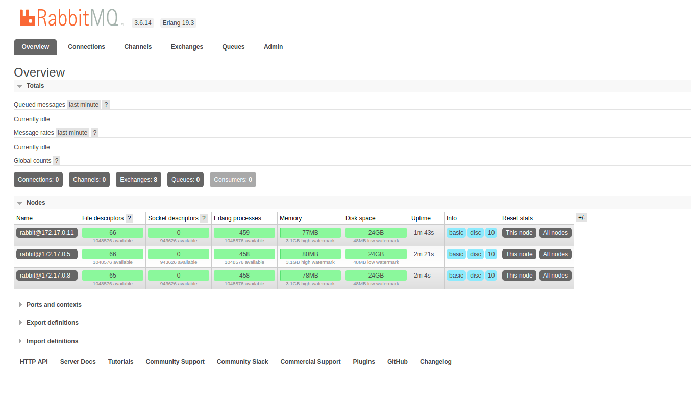

# RabbitMQ 消息队列


RabbitMQ提供了"高可用"的集群部署方式，以提升性能和(或)可用性。

RabbitMQ支持两种形式的集群模式：
* 普通模式: 默认的模式。消息队列的数据结构存在于每个结点上，但实际消息只存储于某一个节点上。这种模式的优点是性能较高。缺点是，一旦存储数据的节点挂掉，消息就暂时不可用了，需要结点启动后才能恢复。
* 镜像模式: 在普通模式的基础上可配置需要镜像的队列。配置队列后，消息数据会自动同步到集群中的每个结点上。该模式的优点是可用性高，缺点是性能相对较低。


在本节，我们将首先配置普通模式的集群，然后配置镜像队列。

## Kubernetes下配置RabbitMQ集群

与Memcached类似，RabbitMQ集群中的节点，是相互独立的，而不是可替代的，因此我们也使用StatefulSet。

然而，RabbitMQ比Memcached更为复杂，他需要磁盘存储，即在StatefulSet上的Volume。这种情况下，是无法直接创建Volume挂载点的，而是需要先手动创建Persistent Volume(简称PV)，然后再通过Persistent Volume Claim(简称PVC)去关联创建可用的PV。上述过程可以参考Kubernetes的[Persistent Volume文档](https://kubernetes.io/docs/concepts/storage/persistent-volumes/)。

我们首先创建3个PV, pvs.yaml:
```yaml
apiVersion: v1
kind: PersistentVolume
metadata:
  name: pv001 
spec:
  storageClassName: standard
  accessModes:
    - ReadWriteOnce
  capacity:
    storage: 20Gi
  hostPath:
    path: /data/pv001/
---
apiVersion: v1
kind: PersistentVolume
metadata:
  name: pv002 
spec:
  storageClassName: standard
  accessModes:
    - ReadWriteOnce
  capacity:
    storage: 20Gi
  hostPath:
    path: /data/pv002/
---
apiVersion: v1
kind: PersistentVolume
metadata:
  name: pv003
spec:
  storageClassName: standard
  accessModes:
    - ReadWriteOnce
  capacity:
    storage: 20Gi
  hostPath:
    path: /data/pv003/
```

在这里，我们使用的是minikube做演示，因而直接创建基于路径的Volume，在实际生产中，你可能需要创建支持自动迁移的Volume，具体可以参考[Storage Classes](https://kubernetes.io/docs/concepts/storage/storage-classes/)。

我们应用一下:
```yaml
kubectl apply -f pvs.yaml

persistentvolume "pv001" created 
persistentvolume "pv002" created 
persistentvolume "pv003" created 
```

在创建RabbitMQ集群之前，我们先要针对rabnbitmq这个metadata修改rbac。rbac是Kubernetes的安全性访问限制，具体原因可以参考这个[Issue](https://github.com/rabbitmq/rabbitmq-peer-discovery-k8s/issues/15)

rabbitmq-rbac.yaml:
```yaml
---
apiVersion: v1
kind: ServiceAccount
metadata:
  name: rabbitmq
---
kind: Role
apiVersion: rbac.authorization.k8s.io/v1beta1
metadata:
  name: rabbitmq
rules:
- apiGroups: [""]
  resources: ["endpoints"]
  verbs: ["get"]
---
kind: RoleBinding
apiVersion: rbac.authorization.k8s.io/v1beta1
metadata:
  name: rabbitmq
roleRef:
  apiGroup: rbac.authorization.k8s.io
  kind: Role
  name: rabbitmq
subjects:
- kind: ServiceAccount
  name: rabbitmq

```

上述修改了rabbitmq的ServiceSccount、Role、RoleBinding默认安全设置，简要来说是允许其访问get和endpoints这两个Kubernetes提供的API。

我们应用上述修改，修改成功:
```yaml
kubectl apply -f ./rabbitmq-rbac.yaml

serviceaccount "rabbitmq" configured
role.rbac.authorization.k8s.io "rabbitmq" configured
rolebinding.rbac.authorization.k8s.io "rabbitmq" configured

```

在创建了pv，修改了rbac后，可以创建rabbitmq集群了，我们来看一下描述文件,rabbitmq-service.yaml:
```yaml
kind: Service
apiVersion: v1
metadata:
  name: rabbitmq
  labels:
    app: rabbitmq
spec:
  type: NodePort
  ports:
  - name: http
    protocol: TCP
    port: 15672
    targetPort: 15672
    nodePort: 31672
  selector:
    app: rabbitmq
---
apiVersion: apps/v1
kind: StatefulSet
metadata:
  name: rabbitmq
spec:
  selector:
    matchLabels:
      app: rabbitmq
  serviceName: rabbitmq
  replicas: 3
  template:
    metadata:
      labels:
        app: rabbitmq
    spec:
      serviceAccountName: rabbitmq
      terminationGracePeriodSeconds: 10
      containers:        
      - name: rabbitmq-autocluster
        image: pivotalrabbitmq/rabbitmq-autocluster
        ports:
          - name: http
            protocol: TCP
            containerPort: 15672
          - name: amqp
            protocol: TCP
            containerPort: 5672
        livenessProbe:
          exec:
            command: ["rabbitmqctl", "status"]
          initialDelaySeconds: 30
          timeoutSeconds: 5
        readinessProbe:
          exec:
            command: ["rabbitmqctl", "status"]
          initialDelaySeconds: 10
          timeoutSeconds: 5
        volumeMounts:
        - mountPath: /var/lib/rabbitmq/mnesia
          name: rabbitmq-pvc
        env:
          - name: MY_POD_IP
            valueFrom:
              fieldRef:
                fieldPath: status.podIP
          - name: RABBITMQ_USE_LONGNAME
            value: "true"
          - name: RABBITMQ_NODENAME
            value: "rabbit@$(MY_POD_IP)"
          - name: AUTOCLUSTER_TYPE
            value: "k8s"
          - name: AUTOCLUSTER_DELAY
            value: "10"
          - name: K8S_ADDRESS_TYPE
            value: "ip" 
          - name: AUTOCLUSTER_CLEANUP
            value: "true"
          - name: CLEANUP_WARN_ONLY
            value: "false"
  volumeClaimTemplates:
  - metadata:
      name: rabbitmq-pvc
    spec:
      storageClassName: standard
      accessModes:
        - ReadWriteOnce
      resources:
        requests:
          storage: 20Gi

```

解释一下上面的描述文件：
# 创建了Headless Service用于暴露管理界面的Web端口31672。这里主要是为了演示，在实际应用中，这个可能是没必要的。
# 创建了rabbitmq的StatefulSet，含有3个节点，其中每个节点通过livenessProbe和readinessProbe检查可用性。 
# 使用volumeClaimTemplates自动生成volumeClaim，这里的template即模板，会自动给StatefulSet中的每一个节点创建一个Volume Claim，命名为rabbitmq-pvc-0/1/2 

下面我们来应用下上面的描述:
```
kubectl apply -f ./rabbitmq-service.yaml

service "rabbitmq" created
statefulset.apps "rabbitmq" created

```

稍过一会后，我们来看一下Web服务器的管理界面，http://192.168.99.100，用户名密码都是guest:



登录成功后，如上图所示。不难发现，已经成功启动了3个结点，并组成了集群，至此，我们的RabbitMQ基本集群配置成功。

## 配置镜像集群

下面，我们来配置镜像策略，在Web管理工具上点击"Admin" -> "Policies" -> "Add / update a policy"，如下填写:
# Name: ha_mirror_queue
# Pattern: ^ 
# Apply to: All exchange and queues
# Defination: 
 # ha-mode:  all
天下好后点击"Add"

配置好后，我们尝试创建一个Queue，在Web管理工具点击"Queues" -> "Add queue"，name写test，其他保持默认，最后点击"Add queue"。

添加完成后，可以发现队列有一个"+2"的标志，如下图所示。这个+2意思是队列有额外的2个备份(主1+镜2一共3个节点)，镜像配置成功。


至此，我们已经完成了RabbitMQ的集群配置、镜像队列配置。

关于Rabbit MQ的高可用、集群的更相信信息，可以查看官方文档:[RabbitMQ 集群](http://www.rabbitmq.com/clustering.html)。
