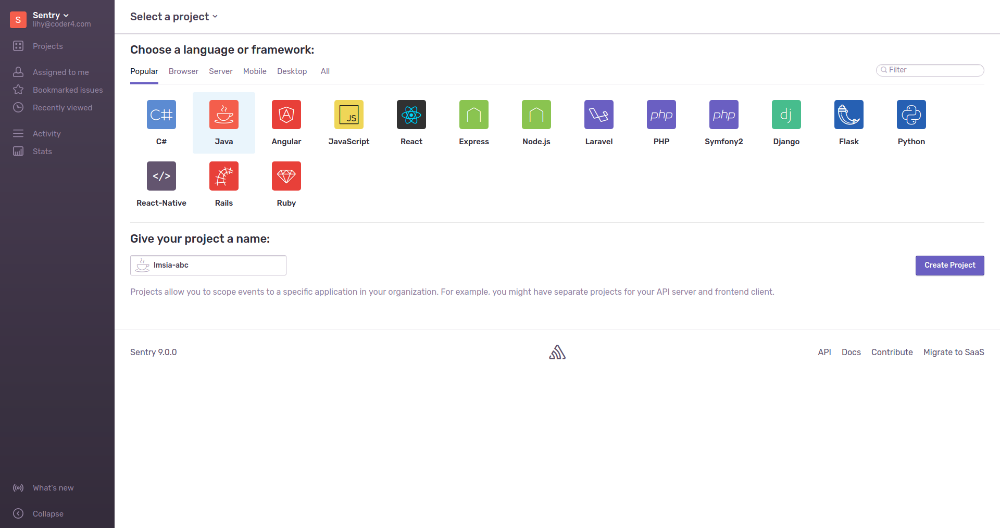
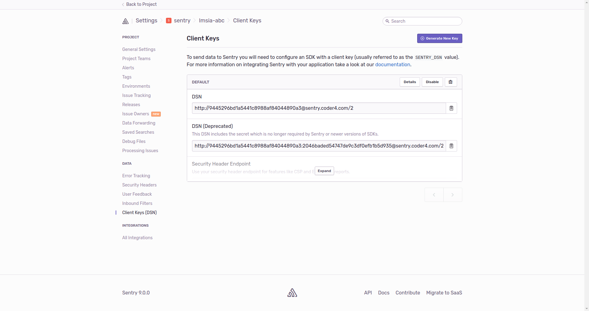
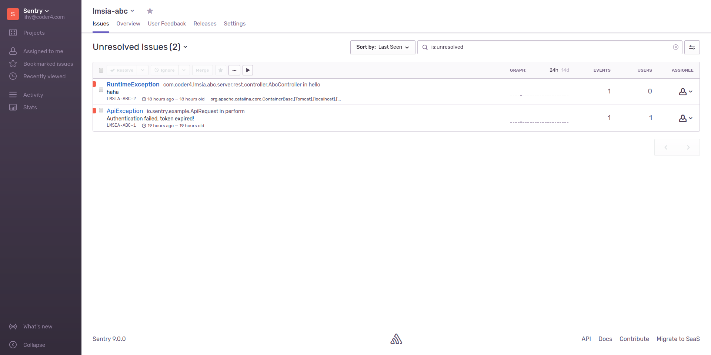

# Spring Boot整合Sentry

在上一小节中，我们探讨了如何运维Senty系统。

搭建好的Sentry系统，需要接入错误事件的数据源，才能发挥功效。

在本节中，我们探讨如何将Spring Boot的微服务项目与Sentry整合起来。

## Sentry中新建项目

Sentry中可以新建若干个项目，对应于若干微服务。

而同一微服务的若干副本应该向同一个Sentry项目发送错误信息的数据，这些副本可以通过来源IP区分。

我们来新建一个Sentry项目，如下图所示：



首先选择一个项目类型，这里选择Java

接着，选择项目名称，我们这里和微服务的名字保持一致lmsia-abc。

新建好项目后，首页会出现项目的列表，及24小时内，该项目的错误事件数量，如下图所示：


## 在Spring Boot中配置日志输出

Sentry提供了丰富多样的接入方式。

在本书中我们采用了Spring Boot默认的logback作为日志系统，Sentry也支持这种方式。

首先添加依赖：
```grovvy
    compile 'io.sentry:sentry-logback:1.7.5'
```

然后将在logback的配置修改如下：
```xml
<?xml version="1.0" encoding="UTF-8"?>
<configuration>

    <!-- For console -->
    <appender name="ConsoleAppender" class="ch.qos.logback.core.ConsoleAppender">
        <encoder>
            <charset>UTF-8</charset>
            <Pattern>%d{yyyy-MM-dd HH:mm:ss.SSS} [%level] [%thread] [%logger] [tr=%mdc{TRACE_ID:-0}] %msg %n</Pattern>
        </encoder>
    </appender>

    <!-- For file with daily rollover -->
    <appender name="ServerFileAppender" class="ch.qos.logback.core.rolling.RollingFileAppender">
        <encoder>
            <charset>UTF-8</charset>
            <pattern>%d{yyyy-MM-dd HH:mm:ss.SSS} [%level] [%thread] [%logger] [tr=%X{TRACE_ID:-0}] %msg %n</pattern>
        </encoder>

        <file>/app/logs/lmsia-abc.log</file>

        <rollingPolicy class="ch.qos.logback.core.rolling.TimeBasedRollingPolicy">
            <!-- daily rollover with gz -->
            <fileNamePattern>/app/logs/lmsia-abc.%d{yyyy_MM_dd}.log.gz</fileNamePattern>
            <!-- keep 30 days' max -->
            <maxHistory>30</maxHistory>
        </rollingPolicy>
    </appender>

    <!-- For sentry -->
    <appender name="SentryAppender" class="io.sentry.logback.SentryAppender">
        <filter class="ch.qos.logback.classic.filter.ThresholdFilter">
            <level>ERROR</level>
        </filter>
    </appender>

    <!-- console only if local active -->
    <springProfile name="local">
        <root level="INFO">
            <appender-ref ref="ConsoleAppender"/>
        </root>
    </springProfile>
    <!-- file,sentry only if test or online active -->
    <springProfile name="test,online">
        <root level="INFO">
            <appender-ref ref="ServerFileAppender"/>
            <appender-ref ref="SentryAppender"/>
        </root>
    </springProfile>

</configuration>
```

与之前的配置文件相比，主要改动为：
* 新增SentryAppender。它会自动沿用之前最近的一个Pattern，及这里的ServerFileAppender。另外，只有ERROR级别的LOG，才会加到这个Appender中。
* 当test或者online的profile激活时，自动上报。你可能希望test和online上报到不同的项目中，别着急，我们后面解决这种情况。

经过上述配置后，每当发生ERROR级别的LOG，就会追加到SentryAppender中。

## Spring Boot中配置DSN

在刚才的配置中，我们并没有制定Sentry服务的IP和端口，如何让Spring Boot知道事件要发送到哪里呢？

此外前面提到，Sentry中支持配置多个项目，如何告诉Spring Boot要发送到Sentry的哪个项目中呢？

这就需要DSN出场了，DSN是Sentry创建项目时生成的一个“KEY”，用于标识和区分不同的项目。

可以在项目的Setting中找到它，如下图所示：



然后，我们在Spring Boot项目的resources目录下，新建sentry.properties文件
```
dsn = http://9445296bd1a5441c8988af84044890a3@sentry-host:sentry-port/2
```

如上配置后，就可以识别出sentry服务的位置已经对应的项目名了。

要说明的是，sentry-host和sentry-port要根据你的需要自行修改，可以是IP也可以是可DNS解析的域名。

如果你想要区分test和online环境，可以如下操作：
* 建立不同的Sentry服务，或者同一个Senty服务下建立不同的项目
* 根据不同的profile分别创建sentry.properties文件，如sentry.properties.test, sentry.properties.online，里面配置不同的dsn key
* 打Docker镜像时加载不同的文件，并重命名为sentry.properties

## 实验异常发生的效果

为了实验效果，我们在微服务代码中，主动抛出一个异常，然后看一下Sentry的lmsia-abc项目：



可以看到，我们的异常被Sentry捕获，并显示了出来。如果同样的ERROR级别LOG发生了多次，还会自动聚合。

至此，我们完成了Spring Boot与Sentry的整合工作。
