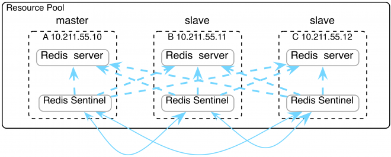

# Redis 数据库的运维

作为纯内存缓存，Memcached拥有非常出色的读写性能，但也存在一个较为严重的缺点：无法持久化。

这意味着，一旦Memcached服务重启(更常见的是掉电)，之前所有的缓存就会丢失。若线上的流量很大，这种重启很容易诱发"缓存雪崩"，从而导致系统故障。

Redis的出现很好的解决了这个问题，它是一款高性能的内存的数据库，既不仅数据的支持持久化、也内置了许多数据结构，方便实现各种需求。在一些场景下[^1]，可以直接用Redis取代Memcached + MySQL的组合。

本节将讨论Redis运维相关的问题。

## Redis单服务器的运维

Redis同时支持单服务器、高可用、集群等三种方案。

我们先来看一下单服务器方案。

顾名思义，单服务器模式下，只启动一个Redis服务进程，若服务挂掉则Redis不可用。可见，这种方案并不保证高可用。

与之前的部署类似，我们同样将Redis部署在Kubernetes集群上，首先是创建Volume挂载点

```shell
sudo mkdir /data/redis

sudo chmod -R 777 /data/redis

```

接着，我们看一下部署文件:
```yaml
apiVersion: v1
kind: Service
metadata:
  name: redis
spec:
  ports:
  - port: 6379
  selector:
    app: redis
  clusterIP: None
---
apiVersion: apps/v1
kind: Deployment
metadata:
  name: redis
spec:
  selector:
    matchLabels:
      app: redis
  template:
    metadata:
      labels:
        app: redis
    spec:
      nodeSelector:
        kubernetes.io/hostname: minikube
      restartPolicy: Always
      hostname: redis
      containers:
      - name: redis-ct
        image: redis:3.2-alpine
        ports:
        - containerPort: 6379
          hostPort: 6379
        volumeMounts:
        - mountPath: "/data"
          name: volume
      volumes:
      - name: volume
        hostPath:
          path: /data/redis/

```

简要说明下：
* 这里使用Redis官方的Docker镜像
* 与MySQL类似，考虑到持久化后的数据量可能较大，我们将Pod绑定到minikube机器上，以固定存储。

应用servie，稍等一会，成功:
```yaml
kubectl apply -f kubectl describe pod redis-798659bc79-vdht7

service "redis" created
deployment.apps "redis" created

```

我们尝试连接一下，首先获取Pod的ContainerId:
```shell

kubectl get pods
NAME                                                READY     STATUS    RESTARTS   AGE
redis-798659bc79-vdht7                              1/1       Running   0          4m

kubectl describe pod redis-798659bc79-vdht7

...
    Container ID:   docker://090c2a7a004200aa6f0c4f3779e3823c401f03ad4f23985fdc08c38f86d6c598
...


```

尝试登录，并登录redis服务器:
```shell
minikube ssh
$ docker exec -i -t 090c2a7a004200aa6f0c4f3779e3823c401f03ad4f23985fdc08c38f86d6c598 /bin/sh

/data # echo "info" | redis-cli 
# Server
redis_version:3.2.12
redis_git_sha1:00000000
....

```

通过上面的操作，可以成功登录Redis服务器，并获取了版本信息。

至此，Redis的单服务器模式配置完成。

## Redis高可用(Sentinel)集群的运维

在上面的Redis单服务器模式下，存在单点故障，假如这个Redis进程挂掉了，则Redis就无法提供服务了。

为了解决可用性，Redis内置了两种高可用方案，较为经典的是Sentinel集群。
Sentinel集群采用主备模式：
* 支持多个Redis服务组，不同服务组通过唯一的master_name标识。
* 组内一个主redis节点提供服务，若干从redis节点定期从主redis节点同步数据。但从节点只作为热备，不提供服务。
* 当某个组的主节点挂掉后，Sentinel服务会检测到主节点故障，并进行主备切换。
* 客户端先连接Sentinel，根据master_name获取组内主Redis节点的IP和端口信息，再连接。



如果你对Sentinel的架构细节感兴趣，可以阅读[官方文档](https://redis.io/topics/sentinel)。

首先，我们来部署一组Redis服务的主节点:
```yaml
apiVersion: v1
kind: Service
metadata:
  name: redis-lmsia-test1-master
spec:
  ports:
  - port: 6379
  selector:
    app: redis-lmsia-test1-master
---
apiVersion: apps/v1
kind: Deployment
metadata:
  name: redis-lmaia-test1-deployment
spec:
  selector:
    matchLabels:
      app: redis-lmsia-test1-master
  template:
    metadata:
      labels:
        app: redis-lmsia-test1-master
    spec:
      nodeSelector:
        kubernetes.io/hostname: minikube
      restartPolicy: Always
      hostname: redis
      containers:
      - name: redis-sentinel-ct
        image: coder4/redis-sentinel-k8s:4.0.10
        ports:
        - containerPort: 6379
        env:
        - name: "MASTER"
          value: "true"
        - name: "MASTER_NAME"
          value: "lmsia_test1"
```

如上所示:
* 我们使用了自定制的镜像redis-sentinel-k8s，其原理可以查看项目主页[docker-redis-sentinel-k8s](https://github.com/liheyuan/docker-redis-sentinel-k8s)
* MASTER=true，开启主节点模式
* MASTER_NAME=lmsia_test1，Redis服务的组名叫lmsia_test1
* 服务组名是redis-lmsia-test1-master，这个很重要，slave节点和sentinel会根据这个来定位master节点。

接着，我们启动lmsia_test1这个服务组一个从节点：
```yaml
apiVersion: v1
kind: Service
metadata:
  name: redis-lmsia-test1-slave
spec:
  ports:
  - port: 6379
  selector:
    app: redis-lmsia-test1-slave
---
apiVersion: apps/v1
kind: Deployment
metadata:
  name: redis-lmaia-test1-deployment
spec:
  selector:
    matchLabels:
      app: redis-lmsia-test1-slave
  template:
    metadata:
      labels:
        app: redis-lmsia-test1-slave
    spec:
      nodeSelector:
        kubernetes.io/hostname: minikube
      restartPolicy: Always
      hostname: redis
      containers:
      - name: redis-sentinel-ct
        image: coder4/redis-sentinel-k8s:4.0.10
        ports:
        - containerPort: 6379
        env:
        - name: "SLAVE"
          value: "true"
        - name: "MASTER_NAME"
          value: "lmsia_test1"
```

如上，组内从节点的启动方式和主节点基本一致，有几个需要特别注意的：
* MASTER_NAME需要和主节点保持一致，即lmsia_test1
* SLAVE=true，开启从节点模式。

我们先来启动这一组主从服务：
```shell
kubectl apply -f ./redis-lmsia-test1-master-service.yaml
kubectl apply -f ./redis-lmsia-test1-slave-service.yaml
```

我们分别登录redis，看看他们的组状态，首先是master，身份是主节点，并可以看到从节点的IP:
```shell
redis-cli>info replication
info replication
# Replication
role:master
connected_slaves:1
slave0:ip=172.17.0.8,port=6379,state=online,offset=168,lag=1
master_replid:9b7dfe0b5f8d538d0f7b81d4095c239f1da72553
master_replid2:0000000000000000000000000000000000000000
master_repl_offset:168
second_repl_offset:-1
repl_backlog_active:1
repl_backlog_size:1048576
repl_backlog_first_byte_offset:1
repl_backlog_histlen:168

```

然后slave，状态是从节点，可以看到主节点的IP:
```shell
# Replication
role:slave
master_host:10.105.12.178
master_port:6379
master_link_status:up
master_last_io_seconds_ago:2
master_sync_in_progress:0
slave_repl_offset:266
slave_priority:100
slave_read_only:1
connected_slaves:0
master_replid:9b7dfe0b5f8d538d0f7b81d4095c239f1da72553
master_replid2:0000000000000000000000000000000000000000
master_repl_offset:266
second_repl_offset:-1
repl_backlog_active:1
repl_backlog_size:1048576
repl_backlog_first_byte_offset:1
repl_backlog_histlen:266

```

接着，我们来启动Sentinel服务：
```yaml
apiVersion: v1
kind: Service
metadata:
  name: redis-sentinel
spec:
  ports:
  - port: 26379
  selector:
    app: redis-sentinel
---
apiVersion: apps/v1
kind: Deployment
metadata:
  name: redis-sentinel-deployment
spec:
  selector:
    matchLabels:
      app: redis-sentinel
  replicas: 3
  template:
    metadata:
      labels:
        app: redis-sentinel
    spec:
      nodeSelector:
        kubernetes.io/hostname: minikube
      restartPolicy: Always
      hostname: redis
      containers:
      - name: redis-sentinel-ct
        image: coder4/redis-sentinel-k8s:4.0.10
        ports:
        - containerPort: 26379
        env:
        - name: "SENTINEL"
          value: "true"
        - name: "MASTER_NAME_LIST"
          value: "lmsia_test1"

```

如上，我们部署了3个节点的Sentinel服务:
* 使用我们定制的镜像redis-sentinel-k8s，其原理可以查看项目主页[docker-redis-sentinel-k8s](https://github.com/liheyuan/docker-redis-sentinel-k8s)
* 打开26379端口，这是默认Sentinel的默认端口
* 环境变量SENTINEL表明以Sentinel模式启动
* 环境变量MASTER_NAME_LIST，列出了所有要监听的组名即master_name，用空格分割开。

我们尝试连接任意一台sentinel来获取主结点的信息:
```
redis-cli -h localhost -p 26379
> SENTINEL get-master-addr-by-name lmsia_test1
1) "10.105.12.178"
2) "6379"
```

组内主redis服务获取成功。

至此，我们已经完成了Redis的Sentinel部署方式。

## 小结
在本节中，我们从讨论了Redis的优点，以及单服务的运维方式。

接着，我们讨论了一种高可用Redis运维方案：Sentinel集群。这种方案可以保证Redis服务的高可用。但该方案也有明显的缺点：主备模式决定了资源的利用率只有50%，造成了一定的浪费。

## 拓展阅读

1. 在小结中，我们提到了Sentinel模式会造成一定的资源浪费。可以采用[Redis Cluster](https://redis.io/topics/cluster-tutorial)的部署模式，在保证高可用的同时，资源利用率。
1. 为了保证高性能，Redis采用异步持久话的方式，分为rdb和aof两种，需要根据实际情况，选择适合的一种甚至混合方案。具体可参见文档（https://redis.io/topics/persistence）
1. 若采用aof方式，积累较多修改后，重启redis会非常慢，可以定期进行[aof rewrite](https://redis.io/commands/bgrewriteaof)压缩aof日志。

[^1]: 若要维持较高性能，建议保留足够的内存以存储全部数据。

