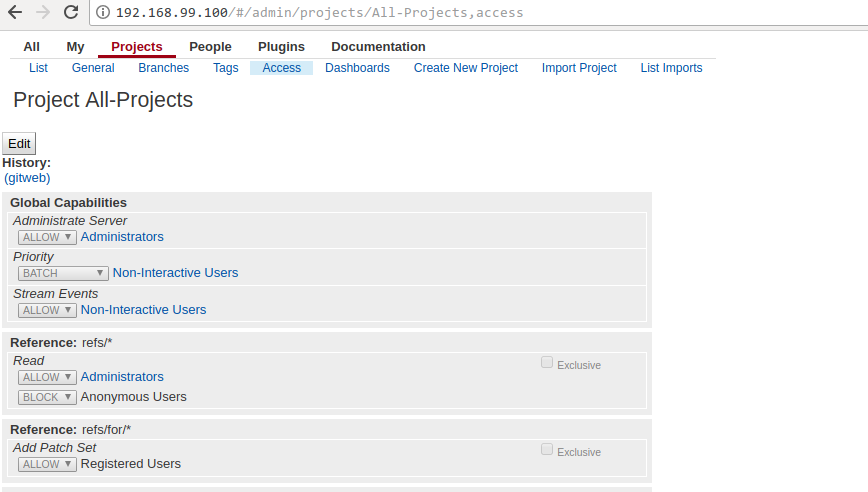

# gerrit 代码的版本管理与审查

## 为什么选用git作为版本管理系统

在实际工作中，绝大多数的项目都使用了代码的版本管理系统。在应用版本管理系统后，可以代码许多好处，相信大家有有所体会：
* 团队合作: 应用版本管理系统后，每个团队成员都可以对每个文件进行修改，而不用担心出现不一致、改动丢失、甚至冲突的情况，版本管理系统会负责这些事情。
* 改动可见: 项目开发往往不是一蹴而就，而是划分为许多个小步骤。我们可以将每个改动作为一次提交，版本管理系统可以展示出两个提交之间的差异，项目的开发进展一目了然。
* 轻松回滚: 如果我们不小心搞出了一个bug，或者某个设计思路出现了较大错误，可以轻松的回滚到某个之前的版本，这也是版本管理系统为我们提供的便利功能。

在版本系统的选型上，我们选用了git，相比于svn，它具有诸多优点：
* 分布式、协作方便: git的设计就是分布式版本管理系统，更适用于多人协作。而svn设计理念就是中央式管理，中规中矩但不利于团队协作。
* 速度更快: 在文件模式上，git基于"指针式"设计，比svn更快。在微服务架构下，创建新服务新项目更加频繁，git的速度优势会更加明显。
* 分支切换: git的分支设计非常轻量级，完全可以在本地完成，而svn则需要完全拉取分支的所有文件，如果你使用svn管理过多分支的大项目，一定对此深有感触。
* 操作更丰富：git提供了丰富的操作手段，当你使用熟练后，会比使用svn的效率更高。

当然，git也有一个最大的缺点：学习曲线较为陡峭。对于新手而言，svn简单看看文档就能上手，git可能需要几天才能掌握基本操作。

但是，面对git带给我们的种种好处，还是值得仔细学习一下的，篇幅所限，我们不会讨论git的用法。

如果你想仔细学习，推荐阅读[廖雪锋的Git教程](https://www.liaoxuefeng.com/wiki/0013739516305929606dd18361248578c67b8067c8c017b000)。

## 为什么代码需要代码审查

如果是一个人做的开源项目，有版本管理系统就足够了。

但对于团队开发，除了版本管理外，一般还应有代码审查(code review)。代码审查的优势如下：
* 相互检查、提升质量: 在开发过程中，我们自己写出的bug，往往是看不出来的，换个人却很容易发现，就是所谓的"当局者迷，旁观者清"。通过相互检查代码，可以有效提升软件质量。
* 让新成员快速提高: 我们希望新加入的团队成员，可以快速学习、快速成长。阅读项目固然是一个很好的方式，但一个项目往往太大，难以下手，代码审查的粒度是一次提交，更小、更适合新手学习。
* 边开发边讨论: 在方案设计阶段，我们可能有了大致的方案，但在开发过程中，往往会暴露出更多的问题。代码审查为这些问题的讨论提供了一个合适的契机，大家可以在代码审核的同时进行讨论。

在系统选型方面，我们选用了较为成熟的gerrit作为代码审查系统。

需要指出的是gerrit同时内置了git服务器的功能，因此我们使用gerrit同时作为版本管理和代码审查系统。

## gerrit系统的基本配置

与之前的LDAP类似，我们也将gerrit部署在Kubernetes上。

首先保证物理机上Volume挂载点的创建
```shell
minikube ssh

$sudo mkdir /data/gerrit
$sudo chown -R 999:999 /data/gerrit/
```

接着我们看一下deployment文件。
gerrit-deployment.yaml
```shell
piVersion: apps/v1
kind: Deployment
metadata:
  name: gerrit-deployment
spec:
  selector:
    matchLabels:
      app: gerrit
  replicas: 1
  template:
    metadata:
      labels:
        app: gerrit
    spec:
      restartPolicy: Always 
      nodeSelector:
        kubernetes.io/hostname: minikube 
      containers:
      - name: gerrit-ct
        image: openfrontier/gerrit:2.15.1
        ports:
        - containerPort: 8080
          hostPort: 80 
        - containerPort: 29418
          hostPort: 29418
        volumeMounts:
        - mountPath: "/var/gerrit/review_site"
          name: volume 
        env:
        - name: GITWEB_TYPE
          value: gitiles
        - name: AUTH_TYPE 
          value: LDAP
        - name:  LDAP_SERVER 
          value: ldap://192.168.99.100
        - name: LDAP_ACCOUNTBASE 
          value: "dc=coder4,dc=com"
        - name: LDAP_ACCOUNTPATTERN
          value: "(cn=${username})"
        - name: LDAP_ACCOUNTSSHUSERNAME
          value: "${cn}"
        - name: LDAP_ACCOUNTFULLNAME
          value: "${sn}"
        - name: LDAP_USERNAME
          value: "cn=guest,dc=coder4,dc=com"
        - name: LDAP_PASSWORD
          value: "guest123"
        - name: WEBURL 
          value: "http://192.168.99.100"
      volumes:
      - name: volume 
        hostPath:
          path: /data/gerrit/
```

虽然文件很长，但并不复杂，我们简单解读下：
* Docker镜像为openfrontier/gerrit:2.15.1
* 端口映射8080到物理机的的80端口上
* 挂载点/var/gerrit/review_site 
* 使用LDAP作为帐号接入，具体配置在之前LDAP一节已经见识过了，这里不再赘述。
* WEB跳转URL定义为 http://物理机IP

下面启动一下：
```shell
kubectl apply -f ./gerrit-deployment.yaml
```

启动成功后，我们访问gerrit，然后点击右上角的"Sign In"即可登录。这里的帐号，填写之前创建的一个LDAP内部帐号。需要特别说明的是，第一个登录的用户，会被gerrit认为是超级管理员，所以请慎重选择。


如果一切顺利的话，就会登录成功了。至此，我们已经完成了gerrit服务器的基本配置。

## gerrit常用插件

gerrit系统的基本功能比较简单，需要配合插件才能发挥出更大优势

在此，我们先安装两个系统内置的插件：
* commit msg长度检查
* 项目下载url生成器

安装插件是通过ssh命令完成的，一次，首先要将ssh密钥的公钥上传到gerrit上。

如果你还没有ssh密钥，可以使用sshkeygen生成，这里不做详细展开。

点击右上角的姓名 -> Settings -> SSH Public Keys，粘贴后点击"Add"。

然后添加插件:
```shell
ssh -p 29418 lihy@192.168.99.100 gerrit plugin install 'jar:file:/var/gerrit/review_site/bin/gerrit.war!/WEB-INF/plugins/download-commands.jar'
ssh -p 29418 lihy@192.168.99.100 gerrit plugin install 'jar:file:/var/gerrit/review_site/bin/gerrit.war!/WEB-INF/plugins/commit-message-length-validator.jar'
```

## gerrit项目的权限控制

gerrit默认的权限配置是对所有人(包括注册用户和匿名用户)开放所有项目。

这样的设置可能过为宽松，可以自行更改。

使用管理员帐号登录，然后进入Projects -> All Projects，点击底部的顶部的"Access"，点击Edit。然后找到 Reference: refs/* -> Read，修改为 -> Block Anonymous Users，修改完成后点击"Save for change"。



我们可以登出当前用户，再次访问gerrit主页，可以发现，在未登录状态，无法找到任何review和项目了。

## 第一个gerrit代码review

下面我们尝试用gerrit完成一个完整的流程:从新建项目、提交、到审核代码。

我们尝试新建一个项目：Projects -> Create New Project:
* 项目名为lmsia-xyz
* 继承自All-Projects
然后点击"Create Project"

创建完成后，我们就可以将代码克隆到本地进行开发了。

选择：Projects -> List 找到lmsia-xyz并点击，在顶部，可以找到Clone工具栏，选择右侧的ssh，底下会出现一行命令：
```shell
git clone ssh://lihy@192.168.99.100:29418/lmsia-xyz
```

我们在本地执行这行命令，即可成功得克隆代码
```shell
git clone ssh://lihy@192.168.99.100:29418/lmsia-xyz
Cloning into 'lmsia-xyz'...
remote: Counting objects: 2, done
remote: Finding sources: 100% (2/2)
remote: Total 2 (delta 0), reused 0 (delta 0)
Receiving objects: 100% (2/2), done.
Checking connectivity... done.

```

如果报权限错误，一般是ssh密钥配置的不对，请检查gerrit个人资料中的key是否为本地设置的公钥。

配置修改后，可以自行通过这条命令测试
```shell
ssh -p 29418 lihy@192.168.99.100

  ****    Welcome to Gerrit Code Review    ****

  Hi 李赫元, you have successfully connected over SSH.

  Unfortunately, interactive shells are disabled.
  To clone a hosted Git repository, use:

  git clone ssh://lihy@192.168.99.100:29418/REPOSITORY_NAME.git

Connection to 192.168.99.100 closed.

```

下面我们新建一个文件：
```shell
touch README.md
```

添加并提交：
```shell
git add .

git commit -m "ADD: README.md"
```

至此，我们已经完成了代码的提交，当然这只是提交到本地git仓库中。

我们还需要推送到gerrit仓库中供别人审核。

在可以推送到gerrit之前，还需要进行2个配置:
1. (每台机器配置一次)若你的操作系统用户名和gerrit用户名一致，需要配置ssh选项。
1. (每个项目配置一次)配置项目的gerrit远程仓库
1. (每个项目配置一次)配置项目推送到gerrit后默认的代码审核人

首先是ssh配置，以我的环境为例，我的操作系统用户名是coder4，而gerrit用户名是lihy，于是在~/.ssh/config中添加如下配置：
```shell
Host 192.168.99.100
    User lihy
    IdentityFile ~/.ssh/id_rsa
    Hostname 192.168.99.100
    Port 29418
```
这个配置并不复杂，就是告诉操作系统，当连接192.168.99.100这个host时，默认用户改为lihy而不是系统默认的coder4

而上面每个项目需要执行一次的2和3稍微，这个操作稍微复杂一些，所以我将它合并成了一个脚本，方便大家调用。
```shell
#!/usr/bin/env bash

GERRIT_HOST="192.168.99.100"
EMAIL_POSTFIX="coder4.com"

set -e

function join { local IFS="$1"; shift; echo "$*"; }

if [ -z "$1" ]; then
    echo "Usage: $0 reviewer[,reviewer ...]"
    exit 1
fi

set -u

if [ -z `git remote | grep origin` ]; then
    echo "Remote origin not found, please clone this repository correctly or add origin remote by 'git remote add'."
    exit 1
fi

scp -p -P 29418 $GERRIT_HOST:hooks/commit-msg .git/hooks/

cat > .git/hooks/pre-commit << EOF
##!/bin/sh
if git-rev-parse --verify HEAD >/dev/null 2>&1 ; then
   against=HEAD
else
   # Initial commit: diff against an empty tree object
   against=4b825dc642cb6eb9a060e54bf8d69288fbee4904
fi
# Find files with trailing whitespace
for FILE in \`exec git diff-index --check --cached \$against -- | sed '/^[+-]/d' | sed -E 's/:[0-9]+:.*//' | uniq\` ; do
    # Fix them!
    sed -i '' -E 's/[[:space:]]*$//' "\$FILE"
    git add "\$FILE"
done
EOF
chmod a+x .git/hooks/pre-commit

originURL=`git remote -v | grep fetch | perl -nle'print $& if m{(?<=origin\t)\S*}'`

(git remote remove review >& /dev/null || exit 0)

git remote add review $originURL

IFS=',' read -a reviewers <<< "$1"

sed -i '/\+refs\/heads\/\*:refs\/remotes\/review\/\*/d' .git/config
for i in "${!reviewers[@]}"; do
  reviewers[$i]="--reviewer=${reviewers[$i]}@$EMAIL_POSTFIX"
done
echo -e "\tpush = HEAD:refs/for/master" >> .git/config
echo -e "\treceivepack = git receive-pack `join " " ${reviewers[@]}`" >> .git/config

```
如上的脚本做了3件事情:
* 从gerrit上下载commit-msg的钩子，这是gerrit生成Change-ID所必须的。
* 配置远程review仓库
* 配置推送后默认的代码审核人

执行一下，默认自己和张三审核：
```shell
initGerrit.sh lihy,zhangsan
```

上述配置完成后，就可以推送你的第一个code review了：
```shell
git push review

Counting objects: 3, done.
Writing objects: 100% (3/3), 244 bytes | 0 bytes/s, done.
Total 3 (delta 0), reused 0 (delta 0)
remote: Processing changes: refs: 1, done    
remote: ERROR: [127a929] missing Change-Id in commit message footer
remote: 
remote: Hint: To automatically insert Change-Id, install the hook:
remote:   gitdir=$(git rev-parse --git-dir); scp -p -P 29418 lihy@192.168.99.100:hooks/commit-msg ${gitdir}/hooks/
remote: And then amend the commit:
remote:   git commit --amend
remote: 
To ssh://lihy@192.168.99.100:29418/lmsia-xyz
 ! [remote rejected] HEAD -> refs/for/master ([127a929] missing Change-Id in commit message footer)
error: failed to push some refs to 'ssh://lihy@192.168.99.100:29418/lmsia-xyz'

```

然而我们发现还是执行失败，这是因为，我们先执行了commit后执行了initGerrit，导致commit时候没有Change-ID。

我们可以按照提示补救一下：
```shell
git commit --amend
```

再次执行推送，成功：
```shell
git push review
Counting objects: 3, done.
Writing objects: 100% (3/3), 285 bytes | 0 bytes/s, done.
Total 3 (delta 0), reused 0 (delta 0)
remote: Processing changes: new: 1, done    
remote: 
remote: New Changes:
remote:   http://192.168.99.100/#/c/lmsia-xyz/+/21 ADD: README.md
remote: 
To ssh://lihy@192.168.99.100:29418/lmsia-xyz
 * [new branch]      HEAD -> refs/for/master

```

我们到gerrit上看一眼，发现已经有了这个推送：


我们点击进去，自行+2，然后点击Submit，如下两图所示。


此时，代码就被成功合并进master分支了。

我们的gerrit默认配置了gitweb,即可以通过网页的方式查看项目的完整源码: Plugsin -> gitiles，界面如下图所示：


通过选择不同项目，可以查看不同分支的完整代码。

至此，我们完成了Gerrit服务的搭建，并通过完整的例子演示了项目的创建、克隆、开发、提交、审核流程。

Gerrit还有很多强大的功能，例如Web上可以创建分支、Rebase代码等等，如果你想探索这些高级用法，可以参考[官方文档](https://gerrit-documentation.storage.googleapis.com/Documentation/2.15.2/index.html)。
