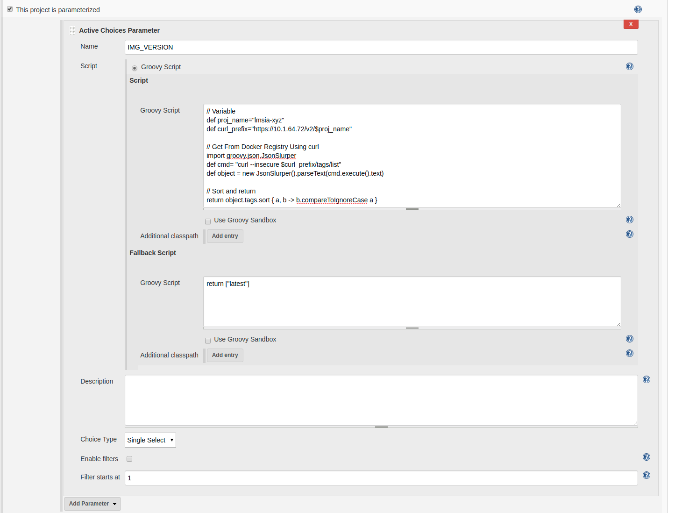
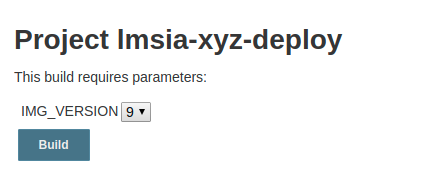

# Jenkins持续部署实战

在上一小节，我们完成了Jenkins的持续集成工作，经过持续集成，我们的代码已经编译成Docker镜像，并被Push到私有仓库中。

在本节，我们接着前一小节的成功，讨论部署问题。

这里的部署指的是将微服务真正地运行在k8s集群系统中，主要涉及如下步骤:
* 获取可部署的Docker镜像版本
* 获取k8s集群操作权限
* 服务操作: 部署服务、重启服务等

其中获取k8s集群的权限有多种方式:
* 通过REST API
* 远程登录k8s的master节点

其中通过REST API的方式更加可靠、易于编程，但在k8s 1.7版本后，新增了权限控制，使用起来较为复杂。

在这里，我们采用直接登录k8s节点的方式。

## 获取Docker镜像的版本列表

前面已经提到，在持续集成时，会打包好最新的镜像到仓库中，并且制定版本为Jenkins的版本。

对于部署环节，却不一定总是需要上线最新版本的镜像。例如，我们上线了一个新功能，半小时后发现有个Bug，需要回滚，此时就需要上线前一个版本的镜像。

如何获取镜像对应的版本呢？我们可以通过"Active Choices Plugin"插件来实现。

首先用管理员登录，Manage Jenkins -> Manage Plugins，安装"Active Choices Plugin"插件。

随后新建一个项目，例如"lmsia-xyz-deploy"，勾选"This project is parameterized"，然后新增一个"Active Choices Parameter"，进行如下配置:



其中的主要代码如下:
```groovy
// Variable
def proj_name="lmsia-xyz"
def curl_prefix="https://10.1.64.72/v2/$proj_name"

// Get From Docker Registry Using curl
import groovy.json.JsonSlurper
def cmd= "curl --insecure $curl_prefix/tags/list"
def object = new JsonSlurper().parseText(cmd.execute().text)

// Sort and return
return object.tags.sort { a, b -> b.compareToIgnoreCase a }
```

上述代码从Docker私有仓库获取"lmsia-xyz"这个镜像的所有版本，然后倒着排序后，返回给Jenkins插件。

点击底部保存，点击"lmsia-xyz-deploy"项目的"Build with Parameters"，可以发现正常显示了版本列表:



