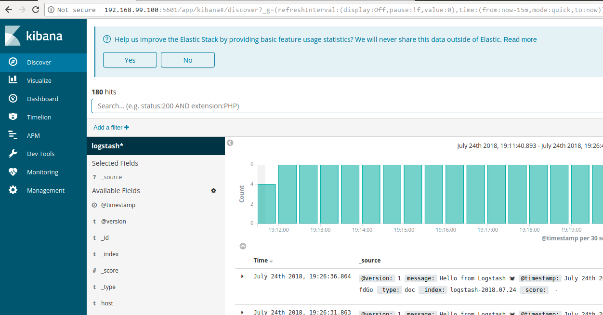

# ELK日志分析平台的运维

在上一节中，我们在日志文件中增加了调用链信息，方便我们追踪每一次调用的完整关系链条。

尽管有了追踪信息，可以更好地排查信息。但在微服务架构下，微服务众多，每个微服务又会启动若干个副本，日志文件的数量会随着文件系统迅速增加。

为了排查一个问题，我们可能要分别到十几个服务上打开几十个不同的文件，效率非常低下。

ELK就是在这种场景下营运而生的，ELK是一套数据分析套件，由Elasticsearch, Logstach, Kibana组成。在微服务架构的应用场景下，一般用来分析日志。

在ELK套件中：
* Logstash负责从不同的微服务、不同的副本上收集日志文件，进行格式化。
* Elasticsearch负责日志数据的存储、索引
* Kibana提供了友好的数据可视化、分析界面


在本节中，我们暂不接入微服务的日志，单纯探讨ELK套件的运维工作。

与之前类似，我们的ELK套件将运行在Kubernetes集群上。

## Elasticsearch的运维

Elasticsearch是ELK套件的核心与中枢。我们首先来看一下它的运维工作。

Elasticsearch的索引需要持久化存储，我们首先声明Pv:

```yaml

apiVersion: v1
kind: PersistentVolume
metadata:
  name: pv031 
spec:
  storageClassName: standard
  accessModes:
    - ReadWriteOnce
  capacity:
    storage: 20Gi
  hostPath:
    path: /data/pv031/

```

然后创建一下这个pv：
```shell

kubectl apply -f ./pvs.yaml

```

下面看一下elasticserch的定义:

```yaml

apiVersion: v1
kind: Service
metadata:
  name: es
spec:
  ports:
  - name: p2
    port: 9200
  - name: p3
    port: 9300
  selector:
    app: elasticsearch
  clusterIP: None
---
apiVersion: apps/v1
kind: StatefulSet 
metadata:
  name: elasticsearch
spec:
  selector:
    matchLabels:
      app: elasticsearch
  serviceName: "es"
  replicas: 1
  template:
    metadata:
      labels:
        app: elasticsearch 
    spec:
      hostname: elasticsearch
      containers:
      - name: elasticsearch-ct
        image: docker.elastic.co/elasticsearch/elasticsearch:6.3.1 
        ports:
        - containerPort: 9200 
        - containerPort: 9300
        env:
        - name: "ES_JAVA_OPTS"
          value: "-Xms384m -Xmx384m"
        volumeMounts:
        - mountPath: /usr/share/elasticsearch/data 
          name: elasticsearch-pvc
  volumeClaimTemplates:
  - metadata:
      name: elasticsearch-pvc
    spec:
      storageClassName: standard
      accessModes:
        - ReadWriteOnce
      resources:
        requests:
          storage: 20Gi

```

如上所述：
* 考虑到日志数据量大了之后，可能需要分片，我们这里采用了StatefulSet，但目前只有一台服务器。
* 暴露两个端口9200和9300，前者是Restful接口，后者是集群同步接口
* 采用IP直发，service伪组名是"es"。这样配置后，所有Pod都可以通过elasticsearch-0.es来直接访问这台服务器

启动一下：
```yaml
kubctl apply -f ./elasticsearch.yaml
```

如果启动失败，可以查看日志，可能是如下原因：
```
kubectl logs elasticsearch-0

...
vm.max_map_count < 262144
...

```

这种情况，可以更改宿主机（物理机）的配置：
```yaml
sudo  sysctl -w vm.max_map_count=262144
```

再次启动一下，可以发现启动成功：
```yaml
NAME                                                READY     STATUS    RESTARTS   AGE
elasticsearch-0                                     1/1       Running   4          6h
```

## Logstash运维

在启动了Elasticsearch后，我们来看一下Logstash的运维。

前面已经提到了，我们本节先不会接入Spring Boot的日志，为了方便演示，我们先Mock一个定时任务，每间隔5秒生成日志：
```yaml
apiVersion: v1
data:
  logstash.yml: |
    http.host: "0.0.0.0"
    xpack.monitoring.elasticsearch.url: http://elasticsearch:9200
    input {
      heartbeat {
        interval => 5
        message  => 'Hello from Logstash 💓'
      }
    }
    
    output {
      elasticsearch {
        hosts    => [ 'elasticsearch-0.es' ]
        user     => 'elastic'
        password => ''
      }
    }

kind: ConfigMap
metadata:
  name: logstash-configmap

```

上述是一个ConfigMap，我们在本书中是第一次使用它。它相当于一个可以加载的Volume，可以方便的直接追加到Pod上。

来创建这个ConfigMap:
```yaml
kubectl apply -f logstash-configmap.yaml
```

下面看一下Logstash的部署：
```yaml
apiVersion: v1
kind: Service
metadata:
  name: ls
spec:
  ports:
  - name: p
    port: 5000
  selector:
    app: logstash
  clusterIP: None
---
apiVersion: apps/v1
kind: StatefulSet 
metadata:
  name: logstash
spec:
  selector:
    matchLabels:
      app: logstash
  serviceName: "ls"
  replicas: 1
  template:
    metadata:
      labels:
        app: logstash
    spec:
      hostname: logstash
      containers:
      - name: logstash-ct
        image: docker.elastic.co/logstash/logstash:6.3.1 
        ports:
        - containerPort: 5000 
        env:
        - name: "ES_JAVA_OPTS"
          value: "-Xms384m -Xmx384m"
        - name: "XPACK_MONITORING_ENABLED"
          value: "false"
        - name: "XPACK_MONITORING_ELASTICSEARCH_URL"
          value: "http://elasticsearch-0.es:9200"
        volumeMounts:
        - name: logstash-configmap
          mountPath: /usr/share/logstash/pipeline/logstash.conf
          subPath: logstash.conf
      volumes:
      - name: logstash-configmap
        configMap:
          name: logstash-configmap

```

如上所述：
* 我们使用了刚才配置的logstash-configmap，并覆盖到Pod的/usr/share/logstash/pipeline/logstash.conf，这个文件中
* 监控地址是elasticsearch-0.es:9200，即前面启动的es服务地址

启动一下：
```shell
kubectl apply -f ./logstash.yaml
```

稍等一会，启动成功：
```shell

NAME                                                READY     STATUS    RESTARTS   AGE
logstash-0                                          1/1       Running   0          7h

```

## Kibana的运维

最后，我们来看一下Kibana的运维：
```yaml

apiVersion: v1
kind: Service
metadata:
  name: kb
spec:
  selector:
    app: kibana 
  clusterIP: None
---
apiVersion: apps/v1
kind: Deployment 
metadata:
  name: kibana 
spec:
  selector:
    matchLabels:
      app: kibana 
  replicas: 1
  template:
    metadata:
      labels:
        app: kibana 
    spec:
      hostname: kibana
      containers:
      - name: kibana-ct
        image: docker.elastic.co/kibana/kibana:6.3.1 
        ports:
        - containerPort: 5601
          hostPort: 5601
        env:
        - name: "ES_JAVA_OPTS"
          value: "-Xms384m -Xmx384m"
        - name: "ELASTICSEARCH_URL"
          value: "http://elasticsearch-0.es:9200"
        - name: "XPACK_MONITORING_ENABLED"
          value: "false"
```

一般来说，Kibana作为前端展示组件，只需要一台就够了，我们直接用了Deployment。

尝试打开浏览器访问一下：



如果一切顺利，可以发现，访问成功。

对于新一些的ElasticSearch/Kibana版本，可能需要先配置一下索引，比较简单，跟着向导就可以完成。

Kibana的功能非常强大，拿来做日志分析实际有点大材小用。感兴趣的话，可以参考[官方使用教程](https://www.elastic.co/guide/en/kibana/current/getting-started.html)。

我们对ELK的运维就介绍到这里。
