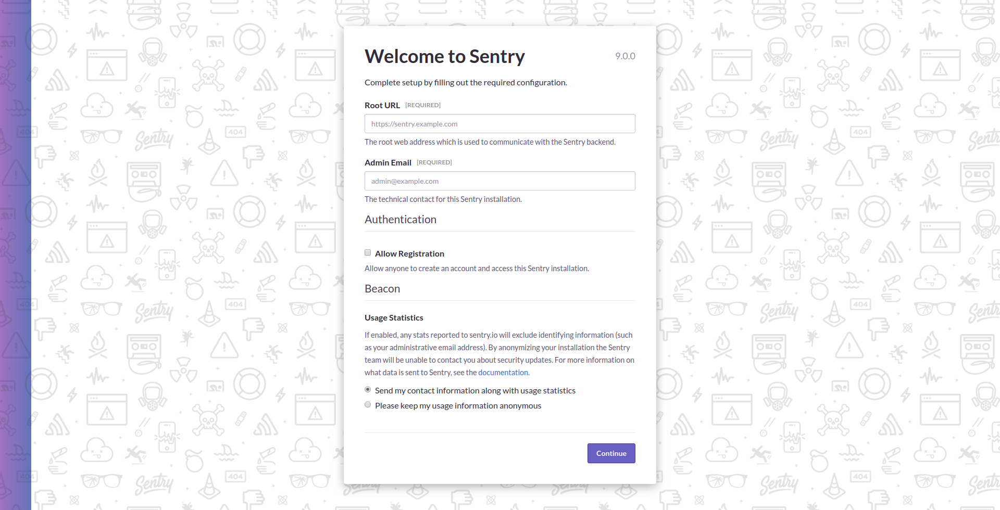

# Sentry 错误预警系统的运维

在上一章中，我们介绍了EBLK的日志分析平台。

在日志分析平台上，我们可以很方便的查找系统的日志。然而，EBLK并总是能满足需求：
* 日志绝大多数是INFO等级的，即信息日志。如果系统运行出现问题，我们想从中查找，实际希望的是找到ERROR类型的或者异常信息。
* 我们经常需要排查一些历史故障，即需要增加时间维度的信息
* 我们希望经常出现的类似错误，能够聚合在一起，方便我们排查

Sentry是一个实时的事件日志和聚合平台，我们可以通过配置，把所有ERROR类型的日志发送给Sentry保存下来，并通过其聚合结果，迅速的定位线上问题。

在本节中，我们将探讨Sentry预警系统的运维工作。

由于Sentry服务本身比较复杂，涉及多个步骤初始化步骤及多个Volume，因此我们不再采用Kubernetes集群，而是通过Docker直接部署在某台物理机上。

## Sentry存储依赖的部署

Sentry服务需要使用两个存储：Redis、Postgres，我们首先启动这两个依赖服务。

首先创建redis, sentry-redis.sh:
```shell
#!/bin/bash

NAME="sentry-redis"
VOLUME="/home/coder4/docker_data/sentry-redis"

# make sure volume valid 
mkdir -p $VOLUME && sudo chmod -R 777 $VOLUME

# kill old and run new 
docker ps -q -a --filter "name=$NAME" | xargs -I {} docker rm -f {}
docker run \
    --hostname $NAME \
    --name $NAME \
    --volume "$VOLUME":/data \
    --detach \
    --restart always \
    redis:4 
```

如上所述:
* 创建了基于redis 4的容器
* 设置volume到/data，这样，重启redis并不会导致数据丢失

接着，我们创建Postegres数据库, sentry_postgres.sh:
```shell
#!/bin/bash

NAME="sentry-postgres"
VOLUME="/home/coder4/docker_data/sentry-postgres"

POSTGRES_DB_USER="sentry"
POSTGRES_DB_PASS="sentry_pass"

# make sure volume valid 
sudo mkdir -p $VOLUME && sudo chmod -R 777 $VOLUME

# kill old and run new 
docker ps -q -a --filter "name=$NAME" | xargs -I {} docker rm -f {}
docker run \
    --hostname $NAME \
    --name $NAME \
    --volume "$VOLUME":/var/lib/postgresql/data \
    --env POSTGRES_USER=$POSTGRES_DB_USER \
    --env POSTGRES_PASSWORD=$POSTGRES_DB_PASS \
    --detach \
    --restart always \
    postgres:10 

```

## Sentry 服务的部署 

在正式部署Sentry之前，首先要生成key：

```shell
docker run --rm sentry config generate-secret-key
```

输出结果是
```
q5%_k4t#w#43rlnd(mr1ms%p8(mjofh9z&4al8d1q&a3f#19_d
```

记住这个key，我们马上会用到。

下面，我们对Sentry进行初始化:
```shell
#!/bin/bash

NAME="sentry-main"
REDIS_LINK="sentry-redis:redis"
POSTGRES_LINK="sentry-postgres:postgres"

SENTRY_SECRET="q5%_k4t#w#43rlnd(mr1ms%p8(mjofh9z&4al8d1q&a3f#19_d"

# kill old and run new 
docker ps -q -a --filter "name=$NAME" | xargs -I {} docker rm -f {}
docker run \
    --hostname $NAME \
    --name $NAME \
    --env SENTRY_SECRET_KEY=$SENTRY_SECRET \
    -it \
    --restart always \
    --link $REDIS_LINK \
    --link $POSTGRES_LINK \
    sentry:9 upgrade

```

在执行db操作一段时间后，会有一个交互，如下：
```
Email: lihy@coder4.com
Password: 
Repeat for confirmation: 
Should this user be a superuser? [y/N]: y
User created: lihy@coder4.com
...
```
创建好的用户，就是之后默认的管理员用户

初始化完毕后，我们正式创建Sentry:
```shell
#!/bin/bash

NAME="sentry-main"
REDIS_LINK="sentry-redis:redis"
POSTGRES_LINK="sentry-postgres:postgres"

SENTRY_SECRET="q5%_k4t#w#43rlnd(mr1ms%p8(mjofh9z&4al8d1q&a3f#19_d"

# kill old and run new 
docker ps -q -a --filter "name=$NAME" | xargs -I {} docker rm -f {}
docker run \
    --hostname $NAME \
    --name $NAME \
    -p 8080:9000 \
    --env SENTRY_SECRET_KEY=$SENTRY_SECRET \
    --detach \
    --restart always \
    --link $REDIS_LINK \
    --link $POSTGRES_LINK \
    sentry:9

```

与上面的初始化相比，脚本基本是类似的，差别在于：
* 使用的是后台运行detach而非-it交互模式
* 没有执行upgrade命令
* 开放了8080端口

执行成功后，我们访问http://localhost:8080，即可成功进入登录界面，如下图所示：


如果你现在登录的话，会提示"Background workers havn't checked in recently..."，即后台收集进程&定时任务没有启动。

我们首先来启动收集进程:

```shell
#!/bin/bash

NAME="sentry-worker"
REDIS_LINK="sentry-redis:redis"
POSTGRES_LINK="sentry-postgres:postgres"

SENTRY_SECRET="q5%_k4t#w#43rlnd(mr1ms%p8(mjofh9z&4al8d1q&a3f#19_d"

# kill old and run new 
docker ps -q -a --filter "name=$NAME" | xargs -I {} docker rm -f {}
docker run \
    --hostname $NAME \
    --name $NAME \
    --env SENTRY_SECRET_KEY=$SENTRY_SECRET \
    --detach \
    --restart always \
    --link $REDIS_LINK \
    --link $POSTGRES_LINK \
    sentry:9 run worker

```

然后启动定时任务：
```shell
#!/bin/bash

NAME="sentry-cron"
REDIS_LINK="sentry-redis:redis"
POSTGRES_LINK="sentry-postgres:postgres"

SENTRY_SECRET="q5%_k4t#w#43rlnd(mr1ms%p8(mjofh9z&4al8d1q&a3f#19_d"

# kill old and run new 
docker ps -q -a --filter "name=$NAME" | xargs -I {} docker rm -f {}
docker run \
    --hostname $NAME \
    --name $NAME \
    --env SENTRY_SECRET_KEY=$SENTRY_SECRET \
    --detach \
    --restart always \
    --link $REDIS_LINK \
    --link $POSTGRES_LINK \
    sentry:9 run cron 

```

启动后稍等一会，我们用初始化时设置的用户名、密码登录系统，进入初始化界面：



配置如下：
* Root URL写入一个可以DNS解析的域名，例如sentry.coder4.com
* Admin Email写入任意一个邮件地址，例如sentry@coder4.com

配置好后，进入如下的登台添加新项目界面，至此，Sentry的部署工作配置完成。


## 思考与拓展
* 在本节的部署中，我们使用了默认的账户配置模式。前面介绍过，在团队内部，应该使用统一的帐号系统以提升效率。如何让Sentry系统接入LDAP帐号服务呢，请自行查找资料，实现这个功能。
