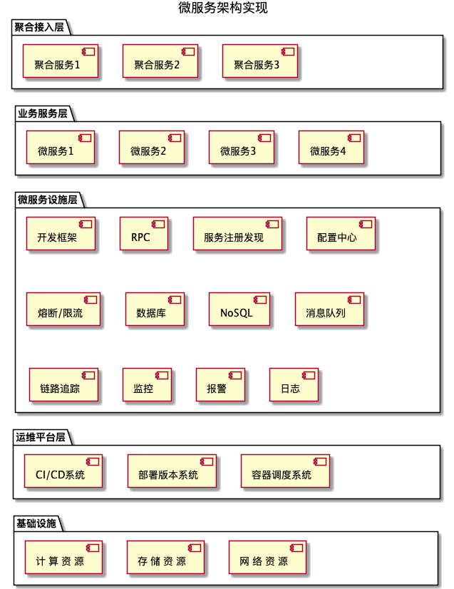

# 微服务架构的一种实现

在上一小节，我们讨论了微服务架构“的的特征、优缺点等话题。

你可能对微服务有了一个模糊的概念，依然感觉不够清晰。

这种感受能够理解。因为，微服务的理论只是提供了一种“架构风格”的建议，并不包含具体的实施方案。

下图展示了一种常见的微服务架构实现：

让我们自底向上、逐层分解：

1. 基础设施层
   
   基础设施层涵盖了服务端运行时，所需要的物理资源。包括：计算资源、存储资源、网络资源等。
   
   针对小型公司，可以直接选用云计算平台的资源(如阿里云、AWS等)；中大型公司出于成本、审计等因素，会自建机房或混合云。
   
   计算资源：CPU、GPU、内存等。除了CPU的核数、内存容量，配比等常见问题，还需要考虑计算资源的弹性伸缩能力，即如何应对“平台大促”等场景带来的流量提升。
   
   存储资源：不仅要考虑磁盘容量，还要考虑磁盘性能([IOPS]([IOPS - 维基百科，自由的百科全书](https://zh.wikipedia.org/wiki/IOPS)))。举个例子：服务端日志主要是顺序写，异步处理 + 大容量机械磁盘就能满足要求；对MySQL等数据库场景，涉及大量随机读，使用SSD可以显著提升性能。
   
   网络资源：外网带宽(峰值)、内网带宽、负载均衡、VPC等。内外网带宽问题较为常见，我们不再讨论。负载均衡：当业务流量规模升高后，接入层的传统软负载解决方案(Nginx、LVS)会显得力不从心。硬件负载均衡(F5)可以提供更高的性能，但做为专用计算的商业产品，其价格在百万以上。这几年，随着Kernel By Pass技术的兴起，基于X86通用硬件 + Linux的的软负载均衡也取得一定的性能突破，感兴趣的话，可以参考这篇[文章]([从Maglev到Vortex，揭秘100G＋线速负载均衡的设计与实现-InfoQ](https://www.infoq.cn/article/Maglev-Vortex/))。

2. 运维平台层
   
   运维平台层是持续交付的重要载体。在[前文](./continuous-x.md)中，我们阐述了“持续交付”对于微服务架构的重要意义。运维平台层，则是持续交付的重要载体，包括：
   
   持续部署系统：集成持续集成、持续部署、并最终实现持续交付。
   
   部署的版本管理系统：管理部署镜像粒度的版本，以支持滚动发布、回滚等部署功能。
   
   容器管理调度平台：容器是一种操作系统级的轻量虚拟化技术。在部署系统中，不仅需要容器技术、还需要容器调度管理系统。这两项技术我们会在后续章节展开讨论。

3. 微服务设施层

4. 业务服务层

5. 接入网关层
