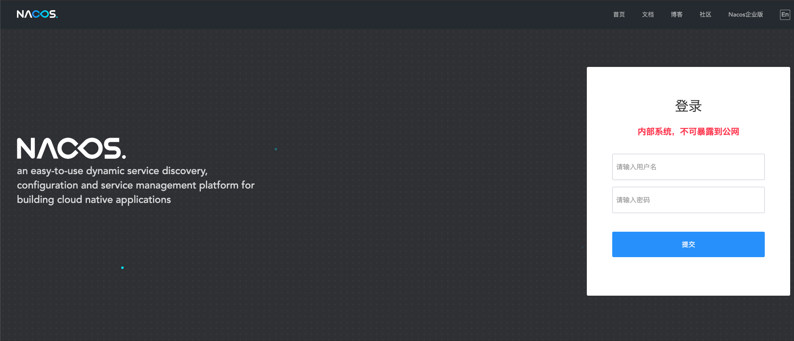

# Nacos注册中心：注册篇


这是一张从互联网上找到的图，你的直观感受是什么？头皮发麻？

实际上，这个球儿是某一年亚马逊的微服务结构图，每一个球的端点，都是一个微服务。

假设某个微服务A，想通过RPC调用另一个微服务B，需要如何实现呢？

1. 微服务B可能有多个实例，他需要先找到一个存活的实例，假设叫做B1。

2. 需要知道B1的IP和端口

3. 建立连接，发起请求，并响应结果。

仔细揣摩上述流程，你会有一些疑问：

1. 怎么知道B的哪个实例还在存活？

2. 怎么知道B1的具体IP和端口？

3. 假设微服务B扩容后，有一个新的B6，如何上服务A感知到呢？

这些都是微服务注册中心要解决的问题。

## Nacos服务注册中心

Nacos 致力于帮助您发现、配置和管理微服务。它提供了一组简单易用的特性集，帮助应用快速实现动态服务发现、服务配置、服务元数据及流量管理。

为了演示基本原理，我们将采用单机模式，在实际生产环境中，建议你采用[集群部署](https://nacos.io/zh-cn/docs/cluster-mode-quick-start.html)。

```bash
#!/bin/bash

NAME="nacos"
PUID="1000"
PGID="1000"


docker ps -q -a --filter "name=$NAME" | xargs -I {} docker rm -f {}
docker run \
    --hostname $NAME \
    --name $NAME \
    -e MODE=standalone \
    -p 8848:8848 \
    -p 9848:9848 \
    -p 9849:9849 \
    --detach \
    --restart always \
    nacos/nacos-server:2.0.3
```

如上，我们采用官方镜像的单机模式，端口介绍如下：

- 8848是web界面和rest api端口

- 9848、9849是gRPC端口

启动成功后，访问http://127.0.0.1:8848，会进入如下界面：



默认的用户名和密码都是nacos。

## 服务端集成Nacos自动注册

接下来，我们实现微服务的自动注册，即服务启动时，将自身的IP和端口，主动注册到Nacos上。

由于我们的架构体系中，通过gRPC进行服务通信，因此我们只注册RPC的部分。我们沿用第2章中的设定，端口是5000。

在服务端集成Nacos有很多方法，一般常见的都是直接使用spring-cloud-starter，但本书并没有采用这种做法，原因是：

- 需要引入大量额外的cloud包，导致技术依赖过于旁杂。

- cloud模式采用注解的方式，并不能很好支持"一个微服务与多个不同微服务通信"的场景。

综上我们直接使用裸客户端的方式，首先是依赖：

```groovy
implementation 'com.alibaba.nacos:nacos-client:2.0.3'
```

接着，我们在第2章的基础上，在RPC服务上做如下修改：

```java
@Configuration
public class RpcServerConfiguration {

    private Logger LOG = LoggerFactory.getLogger(RpcServerConfiguration.class);

    @Autowired
    private BindableService bindableService;

    @Autowired
    private HomsRpcServer server;

    @Autowired
    private NacosService nacosService;

    @Bean
    public HomsRpcServer createRpcServer() {
        return new HomsRpcServer(bindableService, 5000);
    }

    @PostConstruct
    public void postConstruct() throws IOException, NacosException {
        server.start();
        // register
        nacosService.registerRPC(SERVICE_NAME);
    }

    @PreDestroy
    public void preDestory() throws NacosException {
        try {
            server.stop();
        } catch (InterruptedException e) {
            LOG.info("stop gRPC server exception", e);
        } finally {
            // unregister
            nacosService.deregisterRPC(SERVICE_NAME);
            LOG.info("stop gRPC server done");
        }
    }


}
```

如上所示，我们在RPC服务启动的时候，增加了向Nacos的注册、在RPC停止的时候，在Nacos上注销服务。

NacosService是对NacosClient的简单封装，代码如下：

```java
@Service
public class NacosServiceImpl implements NacosService {

    @Value("${nacos.server}")
    private String nacosServer;

    private NamingService namingService;

    @PostConstruct
    public void postConstruct() throws NacosException {
        namingService = NamingFactory
                .createNamingService(nacosServer);
    }

    @Override
    public void registerRPC(String serviceName) throws NacosException {
        namingService.registerInstance(serviceName, getIP(), 5000);
    }

    @Override
    public void deregisterRPC(String serviceName) throws NacosException {
        namingService.deregisterInstance(serviceName, getIP(), 5000);
    }

    private String getIP() {
        return System.getProperty("POD_IP", "127.0.0.1");
    }
}
```

如上所示，我们从yaml中读取Nacos服务的地址，然后从环境变量读取IP地址，并实现了注册、注销功能。

这里，你可以暂时假定环境变量一定可以取到IP，在后续Kubernetes的章节，我们会介绍如何将Pod的IP注入容器的环境变量。

你可以试着启动服务，然后访问Nacos的Web UI，会发现我们的服务正常发现了！

至此，我们实现了服务端的服务注册。至于另一半，服务的发现，请听下回分解！
