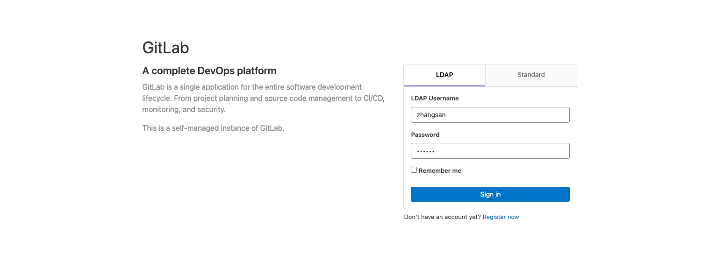

# 基于Gitlab搭建版本控制平台

做为程序员，你一定使用过GitHub / Gitee等开源代码仓库。

对于公司而言，直接将代码上传到开源仓库，对所有用户公开，会面临诸多问题：

- 泄露商业机密

- 安全漏洞泄露

- 被抄袭、盗版

因此，在公司内自建一套私有的代码仓库，是十分必要的。

本节，我们将基于Gitlab，搭建私有的版本控制系统。

## 运行

我们使用Docker版本启动，脚本如下：

```shell
#!/bin/bash

NAME="gitlab"
PUID="1000"
PGID="1000"

VOLUME="$HOME/docker_data/gitlab"
mkdir -p $VOLUME/{data,logs,config} 

docker ps -q -a --filter "name=$NAME" | xargs -I {} docker rm -f {}
docker run \
    --hostname $NAME \
    --name $NAME \
    --volume "$VOLUME/config":/etc/gitlab \
    --volume "$VOLUME/logs":/var/log/gitlab \
    --volume "$VOLUME/data":/var/opt/gitlab \
    --env PUID=$PUID \
    --env PGID=$PGID \
    -p 8888:80 \
    -p 10022:22 \
    --detach \
    --restart always \
    gitlab/gitlab-ce:14.1.8-ce.0
```

解释一下：

- 上述开放了两个端口，8888和22

- gitlab的配置放置于3个不同的位置，我们分别设置了Volume

- 由于该镜像内置了多个进程，启动时间会比较久

启动后，我们首先查看初始管理员密码，在config/initial_root_password文件中，只会保留24小时：

```shell
# WARNING: This value is valid only in the following conditions
#          1. If provided manually (either via `GITLAB_ROOT_PASSWORD` environment variable or via `gitlab_rails['initial_root_password']` setting in `gitlab.rb`, it was provided before database was seeded for the first time (usually, the first reconfigure run).
#          2. Password hasn't been changed manually, either via UI or via command line.
#
#          If the password shown here doesn't work, you must reset the admin password following https://docs.gitlab.com/ee/security/reset_user_password.html#reset-your-root-password.

Password: Sgh1UigBM6ht5ApoW1z2N4JOLHFoivK/EwpQwZ1PylI=

# NOTE: This file will be automatically deleted in the first reconfigure run after 24 hours.
```

## 配置

首先，修改conf/gitlab.rb，修改host，这里可以命名为实际的IP和端口：

```shell
external_url 'http://10.1.172.136:8888'
```

下一步，修改conf/gitlab.rb，添加ldap配置：

```ruby
gitlab_rails['ldap_enabled'] = true
gitlab_rails['prevent_ldap_sign_in'] = false

gitlab_rails['ldap_servers'] = YAML.load <<-'EOS'
  main:
    label: 'LDAP'
    host: '10.1.172.136'
    port: 389
    uid: 'cn'
    bind_dn: 'cn=readonly,dc=coder4,dc=com'
    password: 'readonly123'
    encryption: 'plain' # "start_tls" or "simple_tls" or "plain"
    verify_certificates: false
    smartcard_auth: false
    active_directory: false
    allow_username_or_email_login: false
    lowercase_usernames: false
    block_auto_created_users: false
    base: 'ou=rd,dc=coder4,dc=com'
    user_filter: ''
    attributes: 
      username: ['cn']
      email: ['mail']
      name: cn
    ## EE only
    group_base: ''
    admin_group: ''
    sync_ssh_keys: false
EOS
```

上面的配置信息，与我们在[LDAP](./ldap.md)中的设置的信息维持一致，请根据需要自行修改。

重新应用配置，并重启：

```shell
docker exec -it gitlab /bin/bash
./bin/gitlab-ctl reconfigure
```



重启后，我们使用LDAP中配置的zhangsan / 123456进行登录，成功！

搭建Gitlab只是起点，你还应熟悉基本用法、开发模式，推荐如下文章：

- [安装和使用GitLab]([安装和使用GitLab - 云服务器 ECS - 阿里云](https://help.aliyun.com/document_detail/52857.html))

- [Creating merge requests]([Creating merge requests | GitLab](https://docs.gitlab.com/ee/user/project/merge_requests/creating_merge_requests.html))
